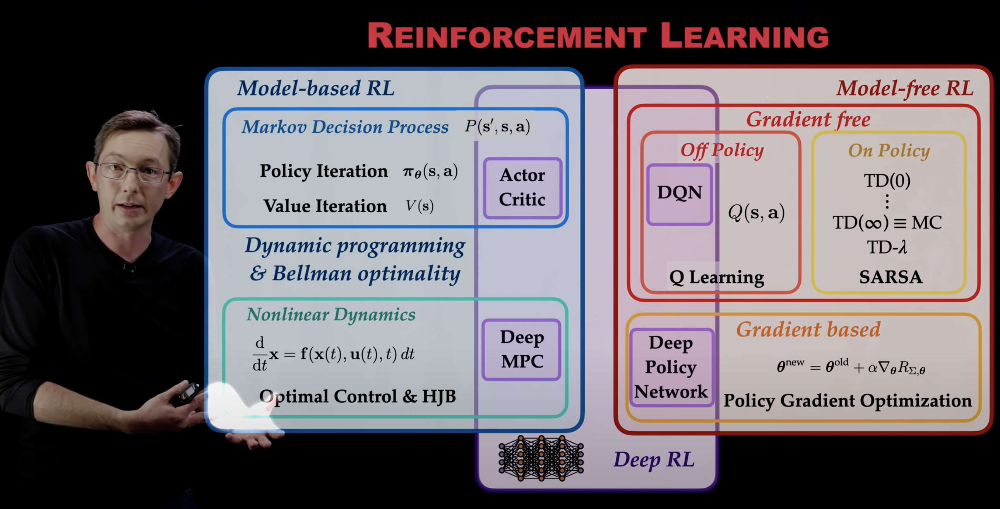

# Reinforcement Learning Notes and OpenAI Gym Examples 

This repository contains my notes and code examples for learning reinforcement learning using OpenAI Gym. The notes are in Jupyter notebooks. 

## Resources

Textbooks: 

 * [**An Introduction to Reinforcement Learning**](http://incompleteideas.net/book/RLbook2020.pdf) 
 * [Algorithms for Reinforcement Learning](https://www.morganclaypool.com/doi/pdf/10.2200/S00268ED1V01Y201005AIM009?casa_token=6YCfS7Oe2H8AAAAA:ow_p4YEHySXdz10d6_8Q5tqYLmzpkLRbntsjFG7Ks9ILXt9GHgsciyQt__Z7VD4407_WOyuMZA)

Open Courses and Videos: 

* [**DeepMind x UCL | Introduction to Reinforcement Learning 2015**](https://www.youtube.com/playlist?list=PLqYmG7hTraZDM-OYHWgPebj2MfCFzFObQ)

Tools: 

* Python, Conda, Visual Studio Code
* [**OpenAI Gym**](https://www.gymlibrary.dev)
* [ChatGPT](https://chat.openai.com): A useful AI tool for answering math questions and generating code examples. 

## Overview of RL Methods

From this [Youtube Playlist by Steve Brunton](https://www.youtube.com/playlist?list=PLMrJAkhIeNNQe1JXNvaFvURxGY4gE9k74): 

